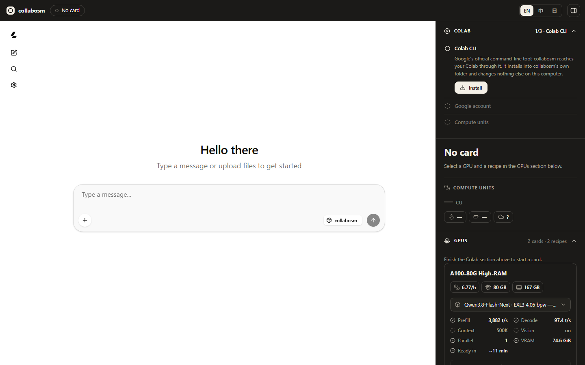
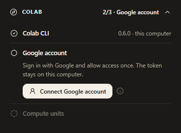
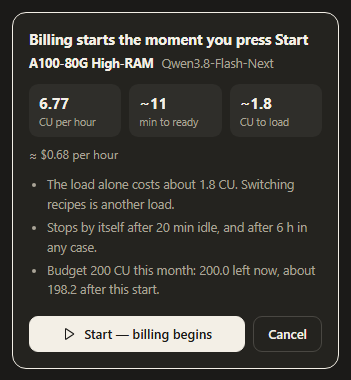

# collabosm — user guide

[](https://github.com/architectds/collabosm/actions/workflows/platforms.yml)

collabosm lets you use a large AI model — **Qwen3.8-27B**, or **Qwen3.8-Flash-Next** — running on
a powerful GPU that is rented in **your own Google Colab account**. You chat with it in a simple
app on your computer, start and stop the GPU with a button, and see the price before you pay.
Other programs, such as Codex or ModelDock, can use the same model.



You pay Google for the GPU only while it runs. collabosm itself is free and open source.

---

## Quick start

1. Make sure your Google account has **Colab compute units** (a paid plan, or pay-as-you-go).
2. Install **Python 3.12 or newer**.
3. Download collabosm, open a terminal in its folder, and run `python frontend/server.py`. The page
   (**http://127.0.0.1:3020**) opens in your browser by itself, and a **collabosm** shortcut appears
   on your desktop for next time.
4. Follow the **Colab** steps on the right: **Install**, then **Connect Google account**.
5. Under **GPUs** press **Start**, then **Start — billing begins**. A few minutes later (about 6 for
   the A100-40G, 11 for the A100-80G) the panel says **Ready**: chat. Press **Stop** when you are
   done.

Every step is explained below.

## Contents

1. [Before you begin](#1-before-you-begin)
2. [Install](#2-install)
3. [Connect your Colab (first time only)](#3-connect-your-colab-first-time-only)
4. [Everyday use](#4-everyday-use): open the app, start a GPU, chat, **stop the GPU**, switch
   models, see what you spent, check the connection
5. [Use the model in other programs](#5-use-the-model-in-other-programs): Codex, ModelDock,
   Open WebUI, your own scripts, another device
6. [Troubleshooting](#6-troubleshooting)
7. [Update or uninstall](#7-update-or-uninstall)
- [Appendix](#appendix): try it without paying, what it costs, the command line, how it works and
  your privacy, for developers and AI agents

---

## 1. Before you begin

### A Google account with Colab compute units

The model needs an **A100** GPU, and Colab rents those only for **compute units**: a paid Colab plan
(Pro or Pro+) or units bought pay-as-you-go. The free tier is not enough. Get them at
[colab.research.google.com/signup](https://colab.research.google.com/signup).

How much? The GPU this uses costs **6.77 compute units per hour, about $0.68**. 100 compute units
run it for about 14 hours. See [what it costs](#b-what-it-costs).

### Python 3.12 or newer

- **Windows:** download Python from [python.org](https://www.python.org/downloads/). In the installer,
  tick **"Add python.exe to PATH"** before you press Install.
- **macOS:** download Python from [python.org](https://www.python.org/downloads/) — the `python3`
  that comes with macOS is too old — or run `brew install python@3.12` if you use Homebrew.
- **Linux:** install it with your package manager, or use [uv](https://docs.astral.sh/uv/).

To check: open a terminal (below), type `python --version` and press Enter. It should say 3.12 or
higher.

### Opening a terminal

A terminal is a window where you type commands.

- **Windows:** open the Start menu, type **PowerShell**, press Enter.
- **macOS:** press ⌘+Space, type **Terminal**, press Enter.
- **Linux:** usually Ctrl+Alt+T.

In this guide, a command such as `python frontend/server.py` is typed into the terminal and run
with Enter. On macOS and Linux, type `python3` where this guide says `python`.

---

## 2. Install

### Download collabosm

- **With git:** `git clone https://github.com/architectds/collabosm.git`
- **Without git:** on the project's GitHub page press **Code → Download ZIP**, and unpack the ZIP
  somewhere easy to find, such as your Documents folder.

### Start the app

In the terminal, go into the collabosm folder and start it:

```bash
cd collabosm
python frontend/server.py
```

(`cd` means "go into this folder". If you unpacked a ZIP, use that folder's name and place, for
example `cd "C:\Users\you\Documents\collabosm-master"`.)

The app prints a few lines, including:

```
[fe] shell      http://127.0.0.1:3020/   <- open this in your browser
```

and opens that page in your browser by itself. If it does not (a computer without a browser, for
example), open **http://127.0.0.1:3020** yourself.

The first start also puts a **collabosm** shortcut on your desktop, with the same square-and-ring
picture as the app's corner. From then on you can start collabosm by double-clicking it instead of
using the terminal ([Open the app](#open-the-app)).

**Leave this terminal window open** while you use collabosm: closing it closes the app, and so does
the **Quit** button (⏻) at the top right of the page. Neither stops a GPU that is running — see
[Stop the GPU](#stop-the-gpu).

### The page

The chat is on the left and the control panel on the right. The first time, the panel starts with
the **Colab** section.

---

## 3. Connect your Colab (first time only)



The **Colab** section has three steps. Do them in order, one button at a time:

1. **Colab CLI — press Install.** This installs Google's official Colab tool into collabosm's own
   folder. It takes about a minute. If the panel says it needs Python 3.12, see
   [Python 3.12 or newer](#python-312-or-newer).
2. **Google account — press Connect Google account.** Your browser opens Google's sign-in page.
   Choose your account and press **Allow**, then close that tab and go back to collabosm.
   - Google's page names Google's own Colab / Cloud tool, not collabosm. That is expected: you are
     signing in to Google's Colab tool, which asks for access to Colab, to Drive (only files this
     app uses) and to Google Cloud.
   - Your sign-in is saved only on your computer.
   - No tab opened? Use **"No tab? Open the sign-in page"** in the panel.
3. **Compute units** shows your balance. If it is zero, add compute units in Colab first.

When all three have a check mark, you are ready. Click the **Colab** heading to fold the section
away; the app remembers. If a step needs you again later — say your sign-in has expired — the Colab
heading lights up and says which step; click it to see the button that fixes it.

Already use Google's Colab tool, for example inside WSL on Windows? collabosm finds it and keeps
your existing sign-in.

---

## 4. Everyday use

### Open the app

Each time you want to use collabosm, double-click the **collabosm** shortcut on your desktop. The
page opens by itself. If collabosm is already running, the shortcut just opens the page again.
(Without the shortcut: in a terminal, `cd collabosm` and `python frontend/server.py`, as the first
time.)

The first check of your Colab connection can take up to a minute.

To close collabosm, press **Quit** (⏻) at the top right of the page. Closing it does *not* stop a
GPU that is running — see [Stop the GPU](#stop-the-gpu); the page warns you first.
- **Windows:** the shortcut starts it with no window at all. Quit is how it closes (or end
  **Python** in Task Manager). What it writes goes to `.collabosm\server.log` in your home folder.
- **macOS:** Quit, or quit **collabosm** in the Dock.
- **Linux:** Quit, or close its terminal window.

Shortcut gone? `python frontend/shortcut.py` in the collabosm folder puts it back.

### Start a GPU

1. In the **GPUs** section, each GPU card has a model menu. **A100-80G High-RAM with
   Qwen3.8-Flash-Next** is the tested choice.
2. Press **Start**. Nothing is rented yet: first you see what it will cost.

   

3. Press **Start — billing begins** to rent the GPU, or **Cancel**, which costs nothing.
4. Wait for **Ready**. The panel shows the steps — Request, Upload, Install, Load, Ready — and how
   far along it is. It takes about 11 minutes, because the model is downloaded and loaded onto every
   new GPU.

Sometimes Colab hands out a smaller GPU than the model needs. collabosm notices within a minute,
gives it back (about 0.13 compute units) and asks you to press **Start** again.

### Chat

Type in the message box on the left and press Enter. The answer appears as it is written.

- **Pictures:** press **+** in the message box to attach an image. The model can see it.
- **A new conversation:** the pencil icon on the far left.
- Your conversations are kept in your browser, on this computer.
- One message is answered at a time.

### Stop the GPU

**The GPU costs money every minute it runs, even while you are not chatting.**

- When you are done, press **Stop** in the top bar. (It is there while a GPU is running.)
- **Closing the browser, or quitting the app, does not stop the GPU.** If that happens, start the
  app again: it finds the GPU that is still running and offers **Stop**.
- Safety nets, in case you forget: collabosm stops the GPU by itself **20 minutes after the last
  message**, after **6 hours** in any case, and whenever a start fails.
- While you are chatting, collabosm tells Colab the GPU is in use, so Colab does not take it away for
  being idle.

### Switch to another model

Press **Stop**, choose another model in **GPUs**, and press **Start**. A switch is a full new start,
with another 6–11 minutes of loading.

### See what you have spent

The **Compute units** section shows your balance as Colab reports it, how fast it is going down right
now, and how long it would last at that rate. While a GPU runs, the status area also shows how long
it has been billed. Colab's own site shows the same balance.

### Check the connection

The **Tunnel** section shows whether the GPU's address answers, how fast, and when it was last
checked (every 20 seconds). When the address stops answering, the section opens by itself and says
which part stopped:
- the tunnel program on the GPU machine,
- the model server there,
- the way from your computer to Cloudflare (network, VPN or DNS),
- or the GPU machine itself.

It can tell these apart because of the **heartbeat**. Every 10 minutes while you use the GPU,
collabosm runs a short health check on the GPU machine through Colab, not through the tunnel. This
also keeps the GPU yours: Colab takes a machine back after about 20 minutes without that kind of
activity, and chat through the tunnel does not count. Every heartbeat is also saved on your computer
in `~/.collabosm/heartbeat.jsonl`, so there is a record even when a GPU disappears.

The **Speed** section shows the speed of the last request from any program, not only this chat.

### Handy to know

- **Languages:** EN / 中 / 日 in the top bar.
- **Hide the panel:** the button at the top right, or Ctrl+B (⌘+B on a Mac).
- **What an icon means:** point at it with the mouse.

---

## 5. Use the model in other programs

While a GPU is running, other programs on your computer can use the model through collabosm. Any
program that works with OpenAI's API can; give it these three settings:

| setting | value |
|---|---|
| Base URL (the API address) | `http://127.0.0.1:3020/v1` — click the address in the status area to copy it |
| API key | anything; the key icon beside the address copies one ready-made — collabosm puts the real key in its place itself |
| Model | the one running, for example `qwen3.8-27b-exl3` (any name works: collabosm answers with the running model) |

The address and the key stay the same for every GPU you start, so you set a program up once.

While no GPU is running, these programs get the answer "No instance is running".

### Codex

1. Open (or create) the file `.codex/config.toml` in your home folder and add:

   ```toml
   model = "qwen3.8-flash-next-exl3"
   model_provider = "collabosm"

   [model_providers.collabosm]
   name = "collabosm"
   base_url = "http://127.0.0.1:3020/v1"
   wire_api = "responses"
   env_key = "COLLABOSM_API_KEY"
   ```

2. Give Codex a key to send — any value will do. Windows (PowerShell): `setx COLLABOSM_API_KEY sk-local`,
   then open a new terminal. macOS / Linux: `export COLLABOSM_API_KEY=sk-local`.
3. Run `codex` as usual.

Codex's file-editing tool (`apply_patch`) needs one more setting; see
[docs/DEVELOPER.md](docs/DEVELOPER.md#tool-calls-end-to-end-through-codex).

### ModelDock

In ModelDock's dashboard, add a custom model with the address `http://127.0.0.1:3020/v1`, any key
(for example `sk-local`), and the Responses transport. Chat completions works too, and the Strata
recipe needs it: Strata has no Responses API.
- **Add it while a GPU is running:** ModelDock asks the address for its models when you add it.
- **This address never changes,** so you don't have to edit ModelDock again when you start a new
  GPU. The `….trycloudflare.com` address does change with every GPU.
- **An existing `trycloudflare.com` entry:** the dashboard cannot edit an address, so remove it and
  add it again with the address above.
- **ModelDock treats an address on this computer as a local engine.** It shortens long
  conversations itself, without asking the model, and adds a few instructions meant for local
  engines.

### Open WebUI

Admin Settings → Connections → OpenAI: base URL `http://127.0.0.1:3020/v1`, any key. More in
[docs/OPEN-WEBUI.md](docs/OPEN-WEBUI.md).

### Your own Python script

Install OpenAI's library once with `pip install openai`, then:

```python
from openai import OpenAI

client = OpenAI(base_url="http://127.0.0.1:3020/v1", api_key="sk-local")
reply = client.chat.completions.create(
    model="qwen3.8-flash-next-exl3",
    messages=[{"role": "user", "content": "Say hello in three languages."}],
)
print(reply.choices[0].message.content)
```

### From another device

The address above works only on this computer. To use the model from another device (a laptop, a
phone app) while the GPU is running, open the **Tunnel** section:

1. **Copy address** copies the GPU's public address (it ends in `.trycloudflare.com/v1`).
2. **Copy key** copies its real API key.
3. Give both to the program on the other device.

Anyone who has both can use your GPU, and your compute units, until you stop it. Both change every
time you start a GPU. (Nothing on this computer needs the real key: collabosm puts it into every
request itself, so the page never holds it until you press **Copy key**.)

---

## 6. Troubleshooting

| what you see | what to do |
|---|---|
| `python` is not recognised (Windows) | Python is not on PATH. Reinstall it with **"Add python.exe to PATH"** ticked, or type `py` instead of `python`. |
| The page does not open | Start collabosm again (its shortcut, or `python frontend/server.py` in a terminal): if it is running, that only opens the page. On Windows, what went wrong is in `.collabosm\server.log` in your home folder. If another program uses port 3020, start with `python frontend/server.py --port 3021` and open http://127.0.0.1:3021. |
| The page did not open by itself | Open http://127.0.0.1:3020 yourself. `--no-browser` starts collabosm without opening it. |
| No shortcut on the desktop | Run `python frontend/shortcut.py` in the collabosm folder. |
| "Looking for the Colab CLI…" for a while | The first check can take up to a minute, most of all on Windows with WSL. |
| "Installing needs Python 3.12 or newer" | Install Python 3.12 or newer (see [Before you begin](#python-312-or-newer)), then press **Check again**. |
| The install failed | Check your internet connection and press **Try again**. The panel shows the install log. |
| The Google page did not open | Use **"No tab? Open the sign-in page"** in the panel. |
| "This sign-in no longer works" | Press **Connect again**. |
| "No compute units left" | Add compute units in Colab. |
| **Start** is greyed out | Finish the Colab section first (all three steps). |
| Chat says "No instance is running" | No GPU is running. Start one and wait for **Ready**. |
| "drew a card below the recipe's VRAM" | Colab handed out a smaller GPU than the model needs; collabosm gave it back (~0.13 compute units). Press **Start** again. |
| "The VM is gone" | Colab took the GPU back, or it was stopped somewhere else. Its billing is closed. |
| The **Tunnel** section says the tunnel is down | Read what it says stopped. The tunnel program or the model server: press **Reconnect**; if that does not help, **Stop** and **Start**. The way from your computer: check your network or VPN. |
| A program says "HTTP Error 530" | It uses the `….trycloudflare.com` address, and the tunnel is down. Point it at `http://127.0.0.1:3020/v1` instead ([Use the model in other programs](#5-use-the-model-in-other-programs)); the **Tunnel** section says what happened. |
| "the stop could not sign in" | Press **Connect again** in the Colab section, then **Stop** again. Until then the GPU may still be billing. |
| Is anything still billing? | The **Connection** section lists what Colab is running on your account right now. |

**Do I need WSL on Windows?** No. If you already use Google's Colab tool inside WSL, collabosm uses
it; otherwise everything runs directly on Windows.

**Does the model run on my computer?** No. It runs on the rented GPU. Your computer only runs the
small collabosm app and your browser.

---

## 7. Update or uninstall

### Update

1. Press **Stop** if a GPU is running, then **Quit** (⏻) at the top right of the page.
2. With git: run `git pull` in the collabosm folder. Without git: download the ZIP again and replace
   the folder.
3. Start the app again.

### Uninstall

1. Press **Stop** if a GPU is running.
2. In the Colab section, press **Disconnect**. This cancels the access you gave at Google and deletes
   the sign-in from your computer.
3. Close the app and delete the collabosm folder.
4. In your home folder (`C:\Users\<you>` on Windows, `/Users/<you>` on macOS), delete the folder
   `.collabosm`: it holds the Colab tool collabosm installed and its record of your sessions. The
   Colab tool also keeps settings in `.config/colab-cli` — delete that too, unless you use Google's
   Colab tool for other things.

---

## Appendix

### A. Try it without paying

```bash
python frontend/server.py --mock
```

The whole panel works in rehearsal: the Colab section is already filled in, **Start** runs through
every step in about half a minute, and the top bar says **Rehearsal · nothing billed**. Nothing is
rented and nothing is billed. (There is no model to chat with in a rehearsal; developers can attach a
stand-in, see [docs/DEVELOPER.md](docs/DEVELOPER.md).)

### B. What it costs

| GPU | model | status | compute units per hour | about per hour | ready in |
|---|---|---|---|---|---|
| A100-40G (the default) | Qwen3.8-27B | measured once | 5.37 (Colab's figure) | $0.54 | ~6 min |
| A100-80G High-RAM | Qwen3.8-Flash-Next | tested | 6.77 (Colab's own rate) | $0.68 | ~11 min |
| A100-40G | Qwen3.8-Flash-Next, on Strata | tested | 5.37 (Colab's figure) | $0.54 | ~20 min |

- Compute units are Colab's currency: about $0.10 each when bought pay-as-you-go.
- Loading counts too: about 1.8 compute units per start on the 80G GPU, which the cost card shows
  before you confirm.
- collabosm keeps a record of every session, and what it cost, in `.collabosm/ledger.json` in your
  home folder.

What you get:
- **Qwen3.8-27B on the A100-40G**
  - Speed: about 2,500 word pieces (tokens) read per second and 50–63 written.
  - Length: two conversations of up to about 400,000 tokens each, and both can answer at the same
    time. A third request waits for one of them to finish.
  - Pictures: understood.
  - These speeds were measured on 2026-09-27 with one answer at a time, before the 400,000-token
    setting. Neither the new setting nor two answers at once has been tried on the GPU yet, and two
    answers share the GPU, so each one writes more slowly than it would alone.
- **Qwen3.8-Flash-Next on the A100-80G**
  - Speed: about 3,900 tokens read per second and about 97 written.
  - Length: conversations up to about 500,000 tokens.
  - Pictures: understood.
  - Those speeds were measured with conversations up to 114,000 tokens.
- **Qwen3.8-Flash-Next on the A100-40G, with [Strata](https://github.com/Niko1221/Strata)**
  - The same model on the smaller, cheaper card: it does not fit there, so Strata keeps the parts
    it cannot hold on the GPU in the machine's memory and has the processor work them out.
  - Speed: about 1,300 tokens read per second at 30,000 tokens of real text (900 at 4,000; 1,400
    at 60,000), and 60–72 written.
  - Length: conversations up to about 260,000 tokens.
  - Pictures: understood.
  - The chat page, ModelDock (with its chat transport) and other programs that use chat
    completions work with it; Codex does not yet, as it needs the Responses API. It answers one
    request at a time.
  - The first start takes about 20 minutes: downloading the 84 GB model, then Strata's own
    preparation. For about a minute and a half after it is ready, it reads prompts more slowly,
    while part of the model moves into memory.

### C. The command line

Everything the panel does also runs from a terminal, with the Python that collabosm installed:
`.collabosm\colab-cli\Scripts\python` (Windows) or `.collabosm/colab-cli/bin/python` (macOS, Linux)
in your home folder — shown as `<python>` below.

```bash
<python> scripts/provision.py up          # start the tested GPU and model
<python> scripts/provision.py down        # STOP it
<python> scripts/provision.py sessions    # what is running on your Colab account
python scripts/recipe.py list             # every GPU + model combination
```

### D. How it works, and your privacy

- collabosm uses **Google's official Colab tool** to rent the GPU, put a small server on it, and stop
  it. Your Google sign-in stays on your computer (`.config/colab-cli/token.json` in your home
  folder); **Disconnect** cancels it at Google and deletes it.
- The model is downloaded from Hugging Face onto the rented machine, always the same fixed version,
  and runs there with [ExLlamaV3](https://github.com/turboderp-org/exllamav3).
- The rented machine answers through an encrypted Cloudflare tunnel that needs a secret key.
  collabosm keeps that key and adds it for you, so it never reaches your browser. The address you
  use, `127.0.0.1:3020`, stays the same even though the tunnel changes with every GPU.
- Everything runs in your own Google account; nothing is sent to the authors of collabosm.
- Colab's terms: use it for yourself. Colab does not allow running a service for other people on its
  machines.

### E. For developers, and for AI agents

- [AGENTS.md](AGENTS.md) — installing and using collabosm, written for an AI coding agent (Codex,
  Claude Code, …) that sets it up or drives it for you
- [docs/DEVELOPER.md](docs/DEVELOPER.md) — how it works inside: measurements, the API, the tests
- [docs/RUNBOOK.md](docs/RUNBOOK.md) — operating notes and the pitfalls behind them
- [docs/MEASURED.md](docs/MEASURED.md) and [docs/CONCURRENCY.md](docs/CONCURRENCY.md) — the numbers,
  and how many conversations one GPU can hold

## Licence

The code is MIT (see `LICENSE`). The model weights are not part of this repository and carry their
own licence — see `NOTICE`.
